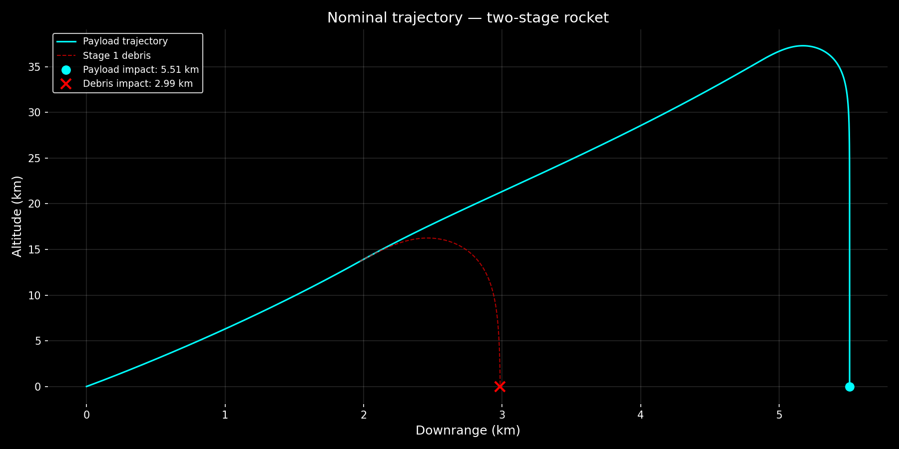
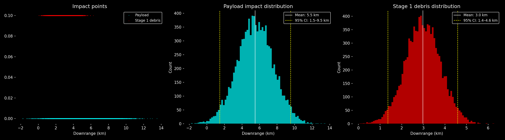

# Rocket Flight Safety Analysis
## Monte Carlo Simulation with Two-Stage Rocket Dynamics

A physics-based Monte Carlo simulation for analyzing rocket launch safety and debris hazard zones. Developed independently, outside of university coursework, as part of a self-directed portfolio in computational physics.

---

## Features

- **Two-stage rocket dynamics**: Full nonlinear equations of motion with thrust, gravity, and drag
- **Time-dependent mass**: Realistic propellant burndown using Tsiolkovsky dynamics
- **Atmospheric drag**: Quadratic drag model with wind effects
- **Stage separation**: Independent trajectories for payload and separated first stage (multi-body)
- **State-space representation**: System of four coupled first-order ODEs
- **Monte Carlo uncertainty quantification**: Parametric uncertainties with 95% confidence intervals
- **Professional visualization**: Trajectory plots and statistical analysis

---

## Physics Model

### State vector

```
y = [x, vx, y, vy]
  x, y    = horizontal/vertical position (m)
  vx, vy  = horizontal/vertical velocity (m/s)
```

### Equations of motion (powered flight)

**Mass evolution (Tsiolkovsky):**

$$m(t) = m_0 - \dot{m} \cdot t, \quad \dot{m} = \frac{m_{\text{propellant}}}{t_{\text{burn}}}$$

**Forces acting on the rocket:**
- Thrust: $\vec{F}_{\text{thrust}} = F \cdot (\cos\theta, \sin\theta)$
- Gravity: $\vec{F}_g = (0, -m(t) \cdot g)$
- Drag: $\vec{F}_{\text{drag}} = -\frac{1}{2}\rho C_d A |\vec{v}_{\text{rel}}| \cdot \vec{v}_{\text{rel}}$, where $\vec{v}_{\text{rel}} = \vec{v}_{\text{rocket}} - \vec{v}_{\text{wind}}$

**State-space formulation (four coupled first-order ODEs):**

$$\dot{x} = v_x$$

$$\dot{v}_x = \frac{1}{m(t)}\left(F\cos\theta - \frac{1}{2}\rho C_d A |v_{\text{rel}}| v_{x,\text{rel}} + F_{\text{wind}}\right)$$

$$\dot{y} = v_y$$

$$\dot{v}_y = \frac{1}{m(t)}\left(F\sin\theta - m(t)g - \frac{1}{2}\rho C_d A |v_{\text{rel}}| v_{y,\text{rel}}\right)$$

### Stage separation (multi-body)

At $t = t_{b1}$, the first stage separates. The state vector $(x, v_x, y, v_y)$ at separation serves as initial conditions for:
1. **Stage 2 + payload**: Continues with new thrust parameters
2. **Stage 1 debris**: Follows a ballistic trajectory ($F_{\text{thrust}} = 0$, $m = m_{\text{dry}}$) until ground impact

After Stage 2 burnout ($t = t_{b1} + t_{b2}$), the payload continues in ballistic flight.

### Ballistic flight (after burnout)

Thrust = 0, mass = constant (dry mass only). Same ODEs with $F_{\text{thrust}} = 0$.

---

## Monte Carlo method

Each simulation parameter has an associated uncertainty modelled as a Gaussian distribution:

| Parameter | Nominal | Uncertainty (1 sigma) |
|-----------|---------|----------------------|
| Stage 1 thrust | 15,000 N | +/- 3% |
| Stage 2 thrust | 5,000 N | +/- 3% |
| Stage 1 mass | 800 kg | +/- 1% |
| Wind speed | 0 m/s | +/- 5 m/s |
| Launch angle | 85 deg | +/- 0.5 deg |

The simulation runs 10,000 times with randomly sampled parameters. The 95% confidence interval is computed as the 2.5th and 97.5th percentile of the resulting impact point distribution.

---

## Output

### Nominal trajectory



Shows payload trajectory (cyan) and stage 1 debris trajectory (red dashed) for a single launch with no wind.

- Payload impact: 5.51 km downrange
- Debris impact: 2.99 km downrange
- Maximum altitude: ~37 km

### Monte Carlo results (10,000 samples)



```
============================================================
            MONTE CARLO FLIGHT SAFETY ANALYSIS
============================================================

Payload impact distribution:
  Mean:    5.5 km
  95% CI:  1.5 - 9.5 km

Stage 1 debris distribution:
  Mean:    3.0 km
  95% CI:  1.4 - 4.6 km

Hazard areas (95% confidence):
  Stage 1 debris:  1.4 - 4.6 km
  Payload:         1.5 - 9.5 km
```

---

## Files

```
monte-carlo-rocket/
├── index.py                    Main entry point
├── rocket_simulator.py         Core physics engine (classes + ODE solver)
├── config.json                 Simulation parameters
├── test_physics.py             Unit tests
├── Herleitung.pdf              Derivation of equations of motion (German, handwritten)
├── nominal_trajectory.png      Output: single trajectory
├── monte_carlo_results.png     Output: statistical analysis
└── README.md
```

---

## Quick start

### Installation

```bash
python -m venv .venv
source .venv/bin/activate  # Windows: .venv\Scripts\activate
pip install numpy scipy matplotlib
```

### Run simulation

```bash
python index.py
```

### Run tests

```bash
python -m pytest test_physics.py -v
```

---

## Configuration

Edit `config.json` to modify simulation parameters:

```json
{
  "stage1": {
    "m_total": 800.0,
    "m_propellant": 500.0,
    "thrust": 15000.0,
    "burn_time": 60.0,
    "Cd": 0.3,
    "A": 0.5
  },
  "monte_carlo": {
    "n_samples": 10000,
    "uncertainties": {
      "thrust_stage1_percent": 3.0,
      "wind_speed_std": 5.0
    }
  }
}
```

---

## Key classes

### StageParameters

Dataclass holding stage configuration with validation.

```python
stage = StageParameters(
    m_total=800.0, m_propellant=500.0,
    thrust=15000.0, burn_time=60.0,
    Cd=0.3, A=0.5,
)
stage.validate()
```

### RocketSimulator

Main simulation engine with OOP structure.

```python
sim = RocketSimulator(stage1, stage2, launch_angle_rad=np.radians(85))

# Single trajectory
payload, debris, trajectory = sim.simulate(wind_speed=0.0)

# Monte Carlo (10,000 samples)
impacts_payload, impacts_debris = sim.monte_carlo(n_samples=10000)
```

---

## Extension ideas

1. Altitude-dependent air density (barometric model)
2. Wind shear profiles instead of constant wind
3. Navier-Stokes CFD for realistic drag coefficient (FEniCSx)
4. DAKOTA integration for advanced uncertainty quantification
5. Interactive animation with real-time parameter sliders
6. 3D trajectory with Earth rotation effects

---

## Dependencies

- Python 3.x
- NumPy
- SciPy
- Matplotlib

---

## Context

This project was developed independently, outside of university coursework, as part of a self-directed computational physics portfolio. It demonstrates multi-body simulation, state-space representation, and Monte Carlo statistical analysis — core techniques in aerospace flight safety engineering.

---

## Author

Silas-Anton Voglmaier — B.Sc. Physics, University of Augsburg
GitHub: [@axiominvariance](https://github.com/axiominvariance)